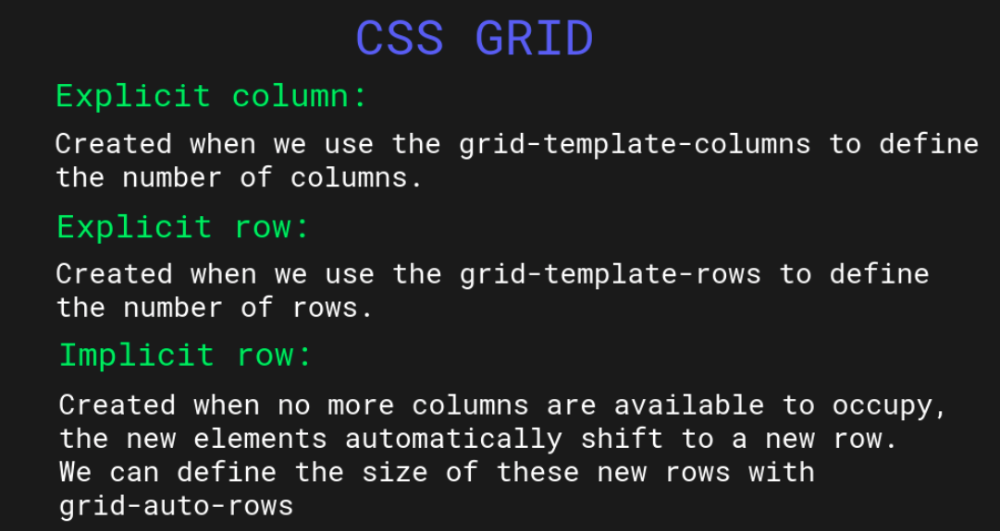
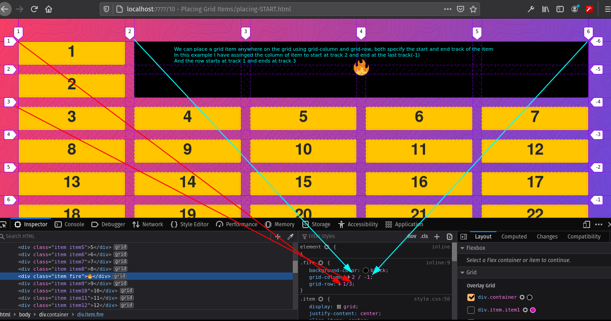

# #100DaysOfCode Log - Round 2 - [Sashank Rampalli]

The log of my #100DaysOfCode challenge. Started on [September 27, Sunday, 2020].

## Log

### R2D1 
Worked on CSS Grid basics, learnt about grid template rows and columns,
implicit and explicit grid, how to change size of implicit rows and cols with grid-auto-rows and grid-auto-cols

How to position the grid items in a grid using grid-row and grid-column properties.

