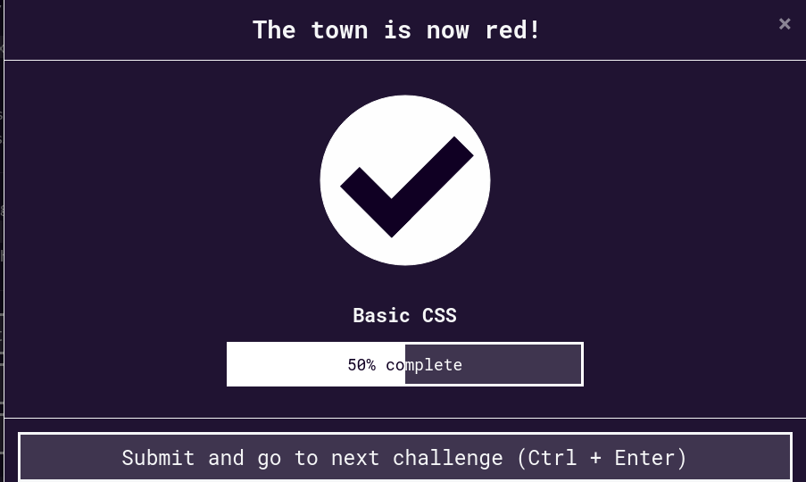
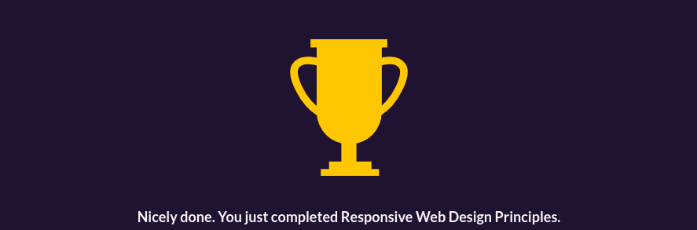

# #100DaysOfCode Log - Round 1 - [Sashank Rampalli]

The log of my #100DaysOfCode challenge. Started on [September 27, Sunday, 2020].

## Log

### R1D1 
Worked on HTML and HTML5 on Freecodecamp.org and completed all assignments in it. I am planning on completing the Responsive Web Design Certification by end of this month.

### R1D2
Worked on CSS today, completed 50% of the course, I will complete CSS tomorrow and build a small project with the knowledge that I have gained.

	
	
### R1D3
Worked on CSS today and completed all the topics, the most valuable thing I learnt today was css variables.

	
	
### R1D4
Worked on Visual Design today, completed 60% of it, I learnt about complementary color scheme and Split complementary color scheme

### R1D5
Worked on Visual Design yesterday and completed it. I learnt about animations, keyframes, transforms,bezier curve 

	

### R1D6
Worked on a coursera course for learning Bootstrap. Started building Cat App v2.0 design, I will implement the stuff I learnt from applied visual design course. 
[Figma Link](https://www.figma.com/file/IGUGLMYrfCsSYICva4z5Ti/CAT-APP-2.0?node-id=0%3A1)

### R1D7
Completed building Cat App V2.0. Now moving on to Applied Accecibility. 
	

### R1D8
Completed Applied Accecibility and Basic Principles of Responsive Web Design, now moving on to FlexBox and Grid. 

	

### R1D9
For the whole day I worked on creating a design for an internship take home assignment, I built the UI and now I have to learn how to use rxjs to use observables and subjects to add products to the cart. 

### R1D10, 11
Worked on my intership assignment but I could not complete it, I need to work on my basics now.

### R1D12
For the whole day I worked on creating a design for an internship take home assignment, I built the UI and now I have to learn how to use rxjs to use observables and subjects to add products to the cart. 

### R1D13
I completed Flexbox and Grid concepts. I learnt a lot about layout design and arrangement with help of these concepts, now I need to build 5 projects to internalize these concepts and get the Responsive Web Design Certificate.

### R1D14
Completed my first project by building a tribute page for free code camp's Responsive Web Design course.
I need to complete 4 more projects to get the Responsive Web Design Certificate.

### R1D15
Completed my second project by building a Form, 3 more projects to go.

### R1D16
Completed building a product landing page for a gym equipment sellet, 2 more projects to go.

### R1D17
Completed Responsive Web Design Certification, completed building a technical documentation page and a Personal Portfolio Website. Now I will be doing the basic of JavaScript from Learn Code Online.

